# Welcome to TaoFlow v2.0

TaoFlow is a DeFi platform on the Bittensor network that enables lending, borrowing, and leveraged trading using TAO as the primary collateral and tradable asset.

## 1. Get started
### 1) Setup wallet extension

Connect to the Subtensor EVM mainnet using standard EVM-compatible wallets.

TaoFlow runs on the Subtensor EVM-compatible blockchain, so you can use standard Ethereum wallets to interact with the network. Use your preferred wallet to store TAO, connect to TaoFlow, and trade.

**Popular compatible wallets include:**

- [Talisman](https://chromewebstore.google.com/detail/talisman-wallet/fijngjgcjhjmmpcmkeiomlglpeiijkld)
- [MetaMask](https://chromewebstore.google.com/detail/metamask/nkbihfbeogaeaoehlefnkodbefgpgknn?hl=en)

#### (1) Create a wallet account

**Create wallet account**
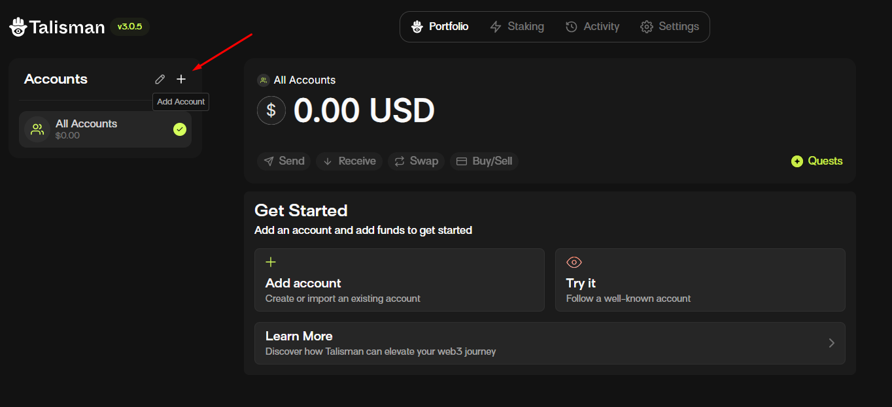

**Select account type**
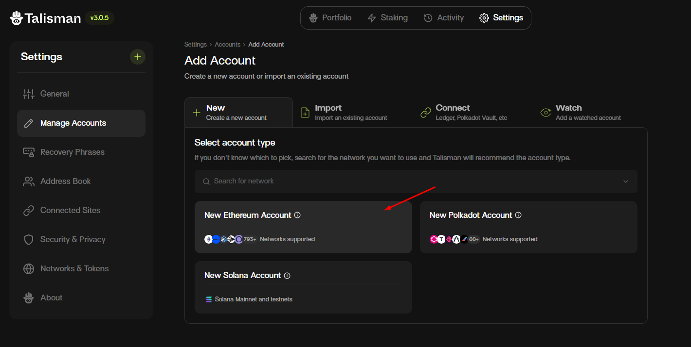

**Insert account name and create**
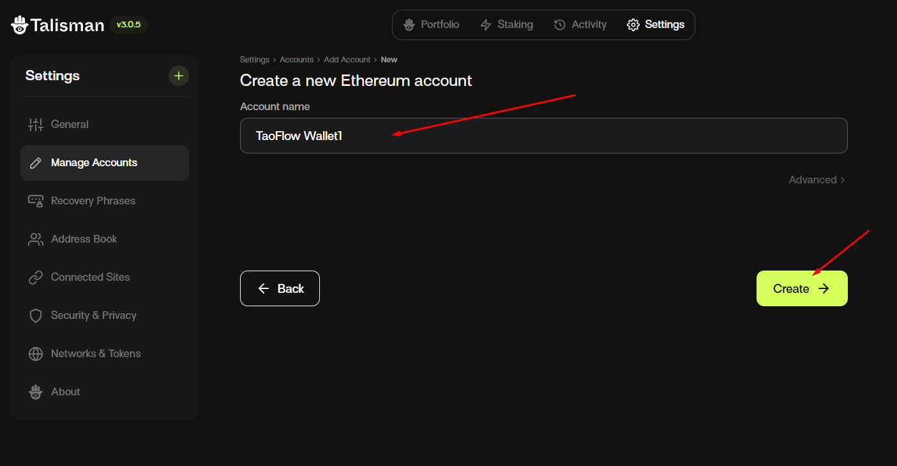

**Save your recovery phrase**
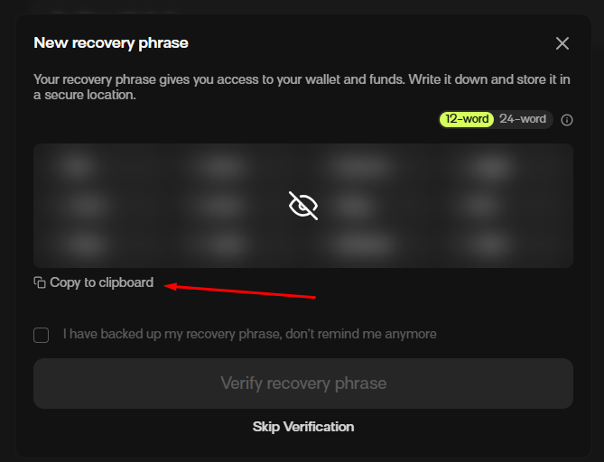

#### (2) Enable Subtensor EVM mainnet

##### Network details

###### Subtensor EVM mainnet
 Setting | Value |
|:--------|:---------|
| Chain ID | 964 |
| Chain name | Subtensor EVM |
| RPC URL | https://lite.chain.opentensor.ai |
| Currency | TAO |

###### Subtensor EVM testnet
 Setting | Value |
|:--------|:---------|
| Chain ID | 945 |
| Chain name | Subtensor EVM Testnet |
| RPC URL | https://test.chain.opentensor.ai |
| Currency | Test TAO |

**Manage network**
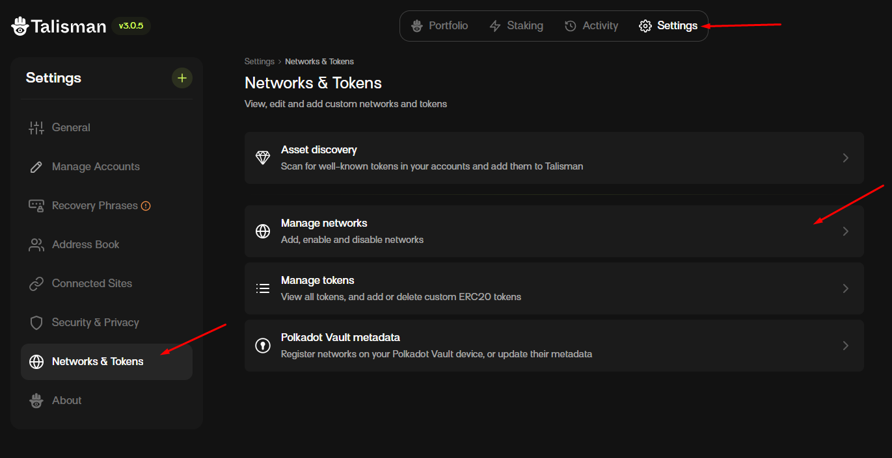

**Search for "Subtensor EVM" and enable it.**
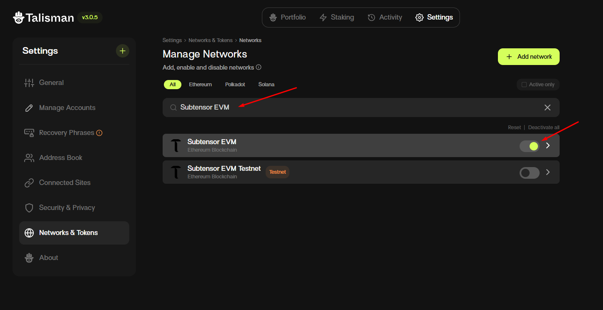

#### (3) Connect your wallet to TaoFlow

**Connect wallet to TaoFlow**
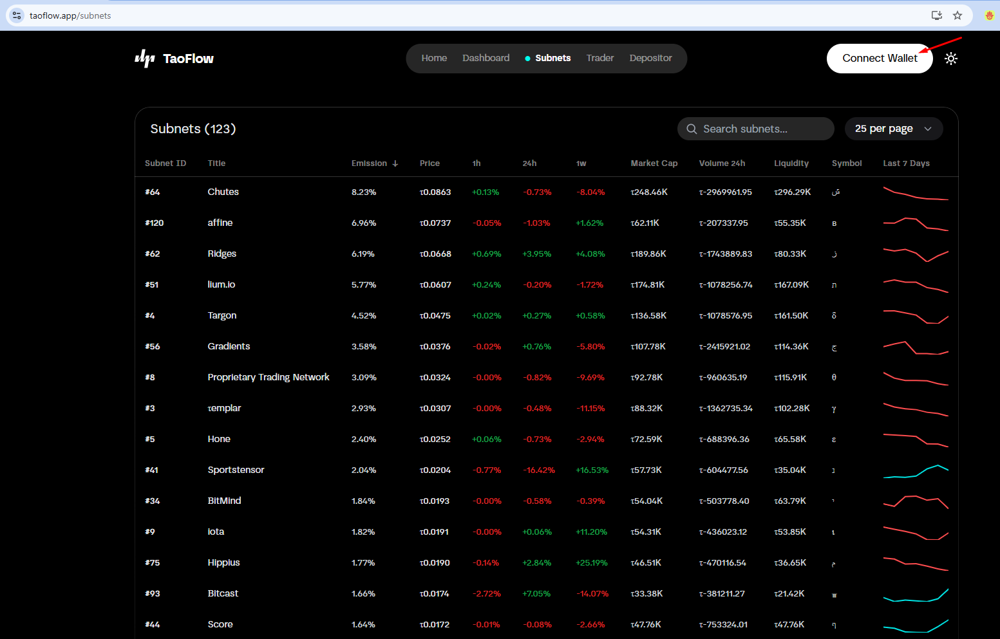

**Unlock the wallet, choose the account, and connect**

	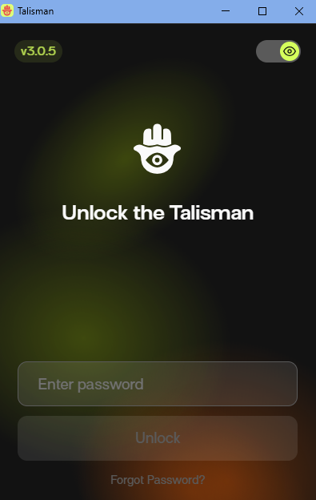
	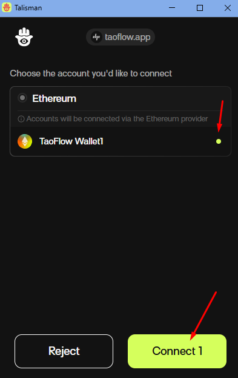

**Connected status**
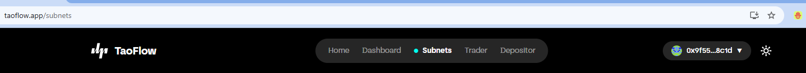

### 2) Start as a depositor
You can start as a depositor on TaoFlow.

Visit your depositor page by clicking the "Depositor" item in the user profile dropdown menu.
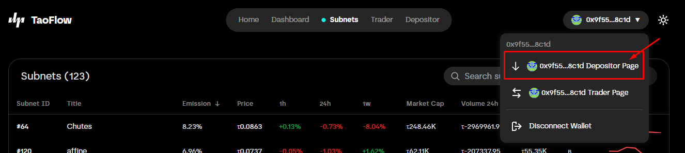

You can view details on the depositor detail page and deposit TAO into TaoFlow.

	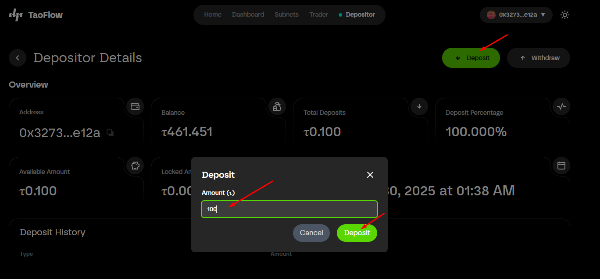
	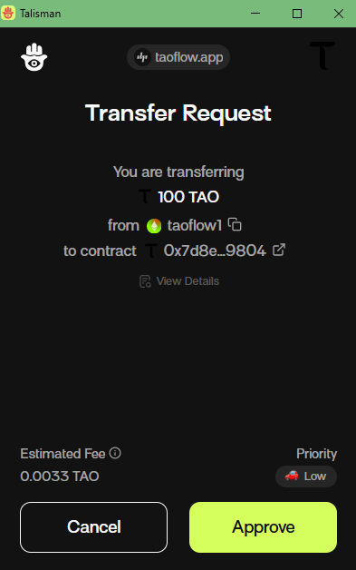

For more details about depositors, see the About Depositor section.

### 3) Start as a trader
You can start as a trader on TaoFlow.

Visit your trader page by clicking the "Trader" item in the user profile dropdown menu.
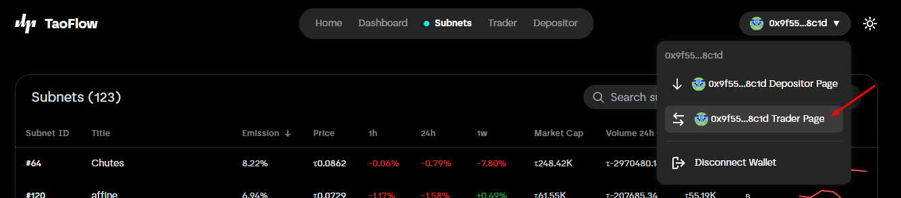

You can view details on the trader detail page and add collateral to TaoFlow.

	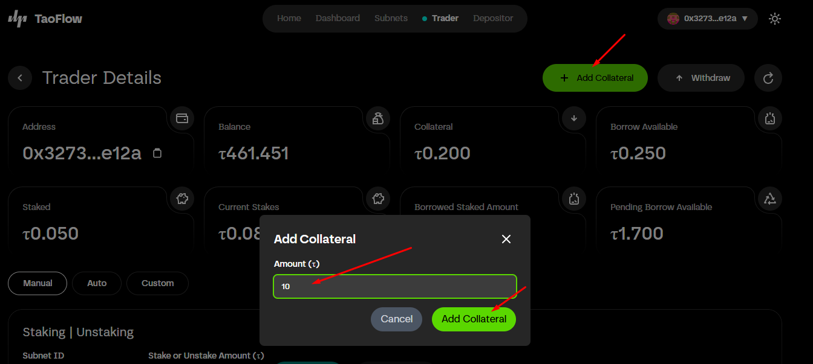
	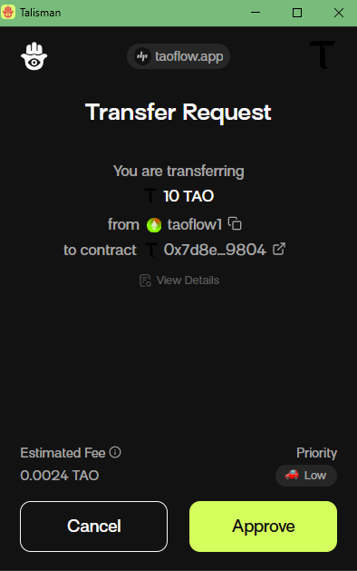

You can stake from the trader detail page or from a subnet detail page.
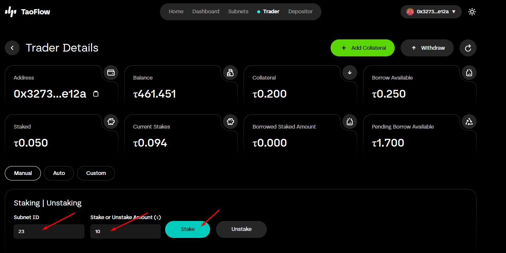

You can also unstake from the trader detail page or from a subnet detail page.
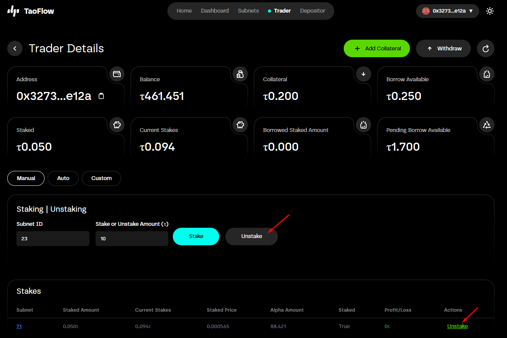

For more details about traders, see the About Trader section.

### 4) Subnets
#### (1) Subnets page
[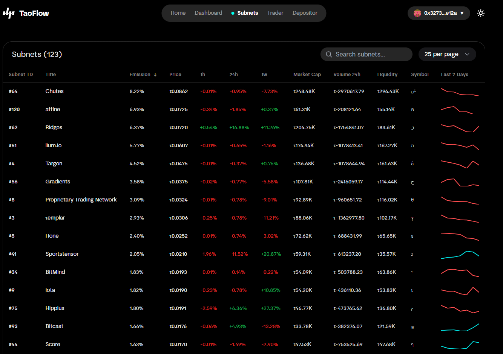](#trader)
You can view all active subnets on the Subnets page. Use the search box to filter subnets; this page lists active subnets.

#### (2) Subnet detail page

You can open a subnet detail page by clicking an item on the Subnets page.

On the subnet detail page, you can view subnet price changes in the trading chart. To fetch the latest data, click the refresh button.

If you connected your wallet, you can also view your trader details on this page.

On this page, you can stake or unstake, similar to the trader detail page.

For more details about traders, see the About Trader section.

## 2. Core concepts for TaoFlow users
TaoFlow consists of a liquidity pool, depositors, and traders.

### 1) TaoFlow pool (liquidity pool)
The protocol stores liquidity in a central pool.

### 2) About depositors (liquidity providers)
A depositor is a liquidity provider. Depositors deposit TAO into the TaoFlow pool and receive a share of trading profits (25% allocated to depositors). Depositors also receive a proportion of Bittensor root subnet rewards.

The deposited amount becomes available for borrowing; traders borrow liquidity from the pool.

**Depositor details**
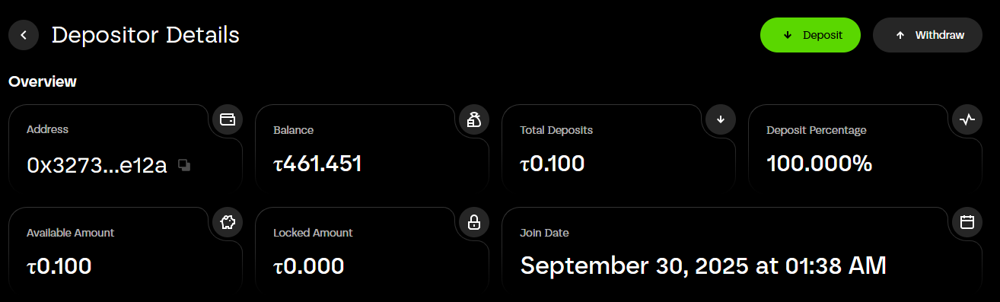

**Address:** Depositor's wallet address.

**Balance:** Depositor's wallet balance.

**Total deposits:** Depositor's deposit amount.

**Deposit percentage:** Depositor's percentage share of the pool.

**Available amount:** The withdrawable amount.

**Locked balance:** If a trader borrows from the pool and locks funds, that balance will be locked.

**Join date:** The date the depositor joined.

### 3) About traders
A trader can add collateral to the protocol and borrow up to 10× their posted collateral. With borrowed funds, a trader can stake (open positions) on active subnets.

If a trader stakes, 1/10 of their collateral will be locked. Traders can withdraw their available (free) collateral at any time, but they cannot withdraw locked collateral until they close (unstake) their positions.

Traders can make profits or losses. Profit and loss are calculated after a trader closes a position.

If a trader makes a profit, the profit is split between the trader, depositors, and TaoFlow protocol by 70:25:5.

If a trader loses, their collateral will be reduced.

Here are examples for illustration. Suppose you post 10 TAO as collateral and borrow 100 TAO.

1) Success case:
You stake all (100 TAO) to subnet 1. The staked amount increases to 110. You unstake.
Your collateral becomes 17 ( = 10 + (110 - 100) × 0.7).

2) Loss case:
You stake all (100 TAO) to subnet 1. The staked amount decreases to 95. You unstake.
Your collateral becomes 5 ( = 10 - (95 - 90)).

If the staked amount falls to 90, TaoFlow automatically unstakes all positions and your collateral becomes 0.

**Trader details**
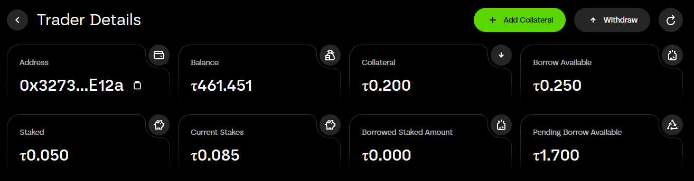

**Address:** Trader's wallet address.

**Balance:** Trader's wallet balance.

**Collateral:** Trader's collateral amount.

**Borrow available:** Amount available to borrow. If the pool balance exceeds 10 × the trader's collateral, the borrow available equals 10 × collateral. In the screenshot, borrow available is 0.25 because the pool balance is 0.1. Example expression:
`borrow_available(0.25) = collateral(0.2) - staked(0.05) + pool_balance(0.1)`

**Staked:** Staked amount.

**Current stakes:** Current staked balance.

**Borrowed staked amount:** Borrowed staked amount. In the screenshot the trader has 0.2 collateral and staked 0.05, so the borrowed amount is 0.

**Pending borrow available:** Pending borrowable amount. The trader can borrow up to 10 × collateral. In the screenshot, the pool balance isn't enough to cover it. Example:
`pending(1.7) = collateral(0.2) × 10 - staked(0.05) - borrow_available(0.25)`

## 3. References

[TaoFlow Pool Smart Contract](https://evm.taostats.io/address/0x3003D36b5D2633057b198E4f1C4aB8498367fb03)  
[TaoFlow LP Token Smart Contract](https://evm.taostats.io/address/0xdd4d2BE756af9135Adb2170788Ea748020b5Ba33)  
[TaoFlow live site](https://taoflow.app)  

## 4. FAQ

### 1) What is TaoFlow?
TaoFlow is a DeFi platform on the Bittensor network that enables lending, borrowing, and leveraged trading using TAO as the primary collateral and tradable asset. Depositors provide liquidity, and traders can trade with up to 10× leverage via staking and unstaking credit generated by TaoFlow.

### 2) Why is TaoFlow useful for users?
The main purpose of TaoFlow is to provide a platform where traders can borrow TAO from holders to trade. Many people want to trade on Bittensor but have very small balances, while other users hold TAO but prefer not to trade. TaoFlow connects these users.

### 3) I am a depositor and have deposited TAO. Can I withdraw my TAO anytime?
Yes. You can withdraw your funds at any time, provided those funds are not locked because of a trader's borrowing. If funds are locked, you must wait until they are unlocked (for example, when a trade finishes or another depositor adds liquidity). When the pool has sufficient liquidity, you can withdraw your funds.

### 4) I am a trader and have collateral. Can I withdraw my collateral anytime?
If you don't have any open positions (stakes), you can withdraw all of your collateral at any time. If you have open positions, you cannot withdraw locked collateral until you close (unstake) those positions.

### 5) How is yield generated on TaoFlow?
Yield comes from two sources: (1) TAO staked to the root subnet, and (2) profit-sharing from successful leveraged trades executed by borrowers.

### 6) What happens if a trader loses money?
Losses are first absorbed by the trader's collateral. Depositor funds are not exposed directly to trader downside. TaoFlow uses an oracle mechanism to monitor open positions in real time and automatically close (unstake) positions if losses exceed the trader's collateral.

### 7) How much can traders borrow?
Traders can borrow up to 10× their posted collateral to stake into high-performing subnet tokens.

### 8) Do I need TAO to use the platform?
Yes. TAO is the native asset for deposits, borrowing, and trading. You'll need TAO in your wallet to interact with the protocol.